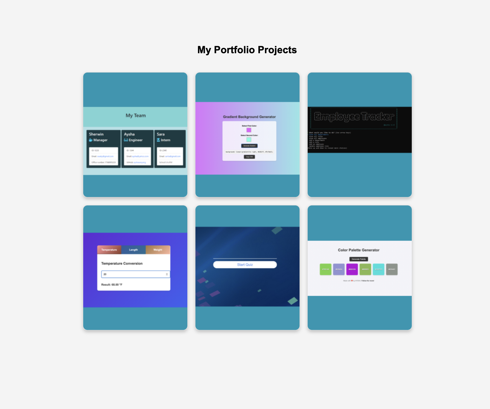

# Day 9: Card Hover Effect for Portfolio Websites

## 🚀 Project Overview

This project showcases a **portfolio card hover effect** where each project card **flips** to reveal a description on the back. The back side includes a **clickable link** to view the actual project. Users can add images to the front side to display project previews, making it visually appealing for portfolio websites.

## 🎯 Features

- ✅ **Card Flip Animation** – Smooth flip effect on hover.
- ✅ **Project Descriptions** – Each card displays project details on the back.
- ✅ **Clickable Links** – Users can click to visit the project.
- ✅ **Customizable Images** – Replace placeholders with real project screenshots.
- ✅ **Responsive Design** – Works on different screen sizes.

---

# Demo page

Click [Here](https://ayshasanyang.github.io/Day-9-Card-Hover-Effect/) to view the page

## 🚀 How to Run

1. Download or clone the repository

```bash
git clone https://github.com/ayshasanyang/Day-9-Card-Hover-Effect.git
```

2. Navigate to the project folder.
3. Open the project files in your vscode or any code editor of your choice
4. Open the `index.html` file in your web browser.

---

## Technologies Used

- **HTML5:** Structure of the web page.
- **CSS3:** Styling for light/dark mode and smooth transitions.

---

### 📸 Preview



---

## 📢 Connect

If you enjoyed this project, let me know! Follow me on social media to see more coding content:

- Instagram: [@codewithaysha](#)
- TikTok: [@Aysha](#)

---
